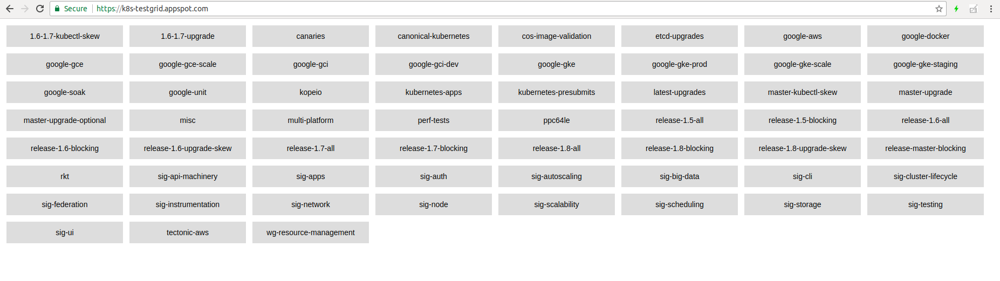
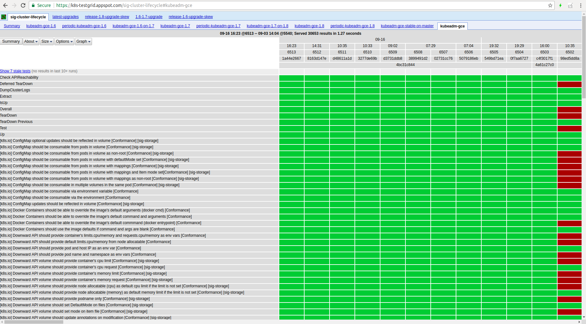
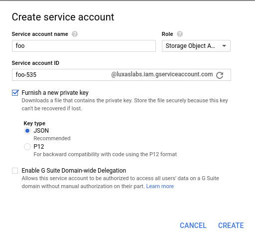
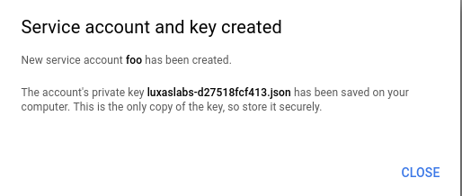

### Staging area for instructions how to do federated testing for Kubernetes

Hi! This is a temporary place for me to put some notes on how to run Kubernetes
e2e tests on your own machine(s) and then make the test results you get uploaded
to https://testgrid.k8s.io, the dashboard that the community uses to check the
health of the project.



Testgrid, shown above, aggregates all the Kubernetes e2e test results in one place,
under different dashboards. An example of what one job's test history is visualized as
is here:



Most of the testing-related code lives in https://github.com/kubernetes/test-infra
The tricks I'm about to show here should be upstreamed there eventually as well.

**Note:** This is a demo and a Proof-of-Concept, not an exhaustive guide to federated testing and all its features.

#### What is federated testing?

Most of the e2e jobs and suites run on Google's infrastructure (GCE), basically Google is
paying for the most of the Kubernetes community's automated test results.

If you want your own results to be shown there, but don't wanna bake a lot of logic into the
test-infra upstream repository, then federated testing is the way to go.
For instance, code for how to run e2e tests on your Raspberry Pis in your hallway shouldn't
go into that repo ;)

So what can you do?

Well, here is a short overview.

#### Create a GCS bucket of choice

For this example, I've created https://console.cloud.google.com/storage/browser/kubernetes-multiarch-e2e-results
as I'm interested in running federated e2e tests on various platforms, like ARM 32- and 64-bit, ppc64le, etc.

You will upload all your test results to this bucket, and the testgrid will then query the results from here.

##### Create subdirectories for different job configurations

Let's say you want to run one job that runs a lot of upgrade tests and want to call this `my-upgrade-suite`.
And to have full coverage for your solution, you also want to test downgrades: `my-downgrade-suite`.

The directory structure looks like this:

```
 - gs://your-bucket-here
   - logs/
     - my-upgrade-suite/
       - 1/
       - 2/
       - ...
       - 123456/
       - latest.txt 	<- a file that tells anyone what the latest run is: "123456"
     - my-downgrade-suite/
       - 1/
       - 2/
       - ...
       - 654321/
       - latest.txt 	<- a file that tells anyone what the latest run is: "654321"
```

That's it! Go ahead and create `gs://your-bucket-here/logs/my-upgrade-suite` and `gs://your-bucket-here/logs/my-downgrade-suite`
as the initial step.

##### Create a ServiceAccount for the uploader

Go to https://console.cloud.google.com/iam-admin/serviceaccounts/project in order to create a new ServiceAccount
to use for the code that uploads the test results to the GCS bucket.

Click on "Create Service Account" and specify a name of choice.
Select the "Storage -> Storage Object Admin" role for this ServiceAccount and select "Furnish a new private key"



When clicking the "Create" button, you will see that a JSON file was automatically downloaded to your computer.
This is the only place where your Service Account is created, so store and distribute it carefully.



##### Install `gsutil` and set up access control for the bucket 

Then go to the machine(s) you want to be able to push results to GCS and install `gsutil`:

```bash
export CLOUD_SDK_REPO="cloud-sdk-$(lsb_release -c -s)"
echo "deb http://packages.cloud.google.com/apt $CLOUD_SDK_REPO main" | sudo tee -a /etc/apt/sources.list.d/google-cloud-sdk.list
curl https://packages.cloud.google.com/apt/doc/apt-key.gpg | sudo apt-key add -
sudo apt-get update && sudo apt-get install google-cloud-sdk
```

Assuming the JSON file containing your ServiceAccount is named `sa.json`, you make `gsutil` use that Service Account by executing this command:

```bash
gcloud auth activate-service-account --key-file sa.json
```

Then you can set up proper access control for the bucket.

**It has to be publicly readable in order for consumers to be able to browse your test results**

You can achieve that with this command:

```bash
gsutil acl ch -u All:R gs://your-bucket-here
```

#### Overall testing flow

For the purposes of this demo, these scripts create a local `kubeadm` cluster when new builds are noticed in the
official Kubernetes CI GCS repos.

The overall flow will look like this:
1. Wait for a new CI build to appear in `dl.k8s.io/ci-cross/latest.txt`
1. Create the `gs://${GCS_BUCKET}/logs/${JOB_SUITE}/${JOB_NUMBER}/started.json` file that tells everyone that this job is running
1. Download all the new binaries from `dl.k8s.io/ci-cross/${VERSION}/bin/linux/${ARCH}/`
1. Run `kubeadm init` and install a pod network solution using Weave Net
1. Build a Docker image locally containing the `kubectl` and `e2e.test` binaries required for running tests
1. Submit a `"batch/v1".Job` to the Kubernetes cluster. This Job will run the e2e results inside of the cluster
   1. Note: You can edit the `-ginkgo.focus` flag by editing the `scripts/e2e-job.yaml` file
1. Wait for the in-cluster e2e job to complete
1. Upload the test results and other artifacts to `gs://${GCS_BUCKET}/logs/${JOB_SUITE}/${JOB_NUMBER}/`, and also create the `finished.json` file
1. Repeat

You can perform all this with some simple proof-of-concept bash scripts I've created.
First, clone this repo:

```
git clone https://github.com/luxas/k8s-federated-testing
```

The rest of this guide will assume you're inside of the `k8s-federated-testing` directory created.

##### Install kubeadm (if you don't already have it)

For convenience, there is a `scripts/install-kubeadm.sh` script that performs the steps outlined in the
[official kubeadm docs](https://kubernetes.io/docs/setup/independent/create-cluster-kubeadm/).

This assumes you're running Ubuntu 16.04+

```bash
scripts/install-kubeadm.sh
```

##### Start running e2e tests

There is a script that will do everything described above for you in a really easy manner.
Just execute this command, replacing `your-bucket-here` and `my-upgrade-suite` with the real values:

```bash
scripts/run-federated-tests.sh your-bucket-here my-upgrade-suite
```

Optional env variables here are:
 - `ARCH`: The architecture of the host machine. Defaults to `amd64`
 - `POD_CIDR`: The subnet for the pods to use. Defaults to `10.32.0.0/16`, if `10.0.0.0/8` is already used, you may set this to `172.30.0.0/16` for instance

After all the tests have been executed, you should be able to see the results here:

https://console.cloud.google.com/storage/browser/your-bucket-here/logs/my-upgrade-suite

Real example: https://console.cloud.google.com/storage/browser/kubernetes-multiarch-e2e-results/logs/kubeadm-luxas-packet-arm64/

#### Wrapping up!

That's it! Now you can submit a PR [similar to mine](https://github.com/kubernetes/test-infra/pull/4396)

Basically, you need to edit `buckets.yaml` and `testgrid/config/config.yaml` in the test-infra repo to tell the testgrid to
pull and view your test results as well. It might take a couple of minutes for your test results to show up.

Have fun!


#### License

MIT
